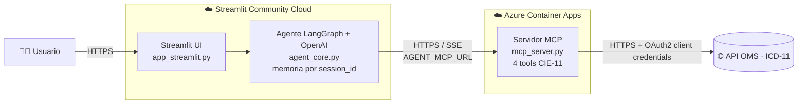

# 🩺 Sistema de Agentes Clínicos CIE-11

🔗 **App en vivo:** [cie11agentic.streamlit.app](https://cie11agentic.streamlit.app/) &nbsp;|&nbsp; **Repositorio:** [github.com/dalia1992/cie11_agentic_helper](https://github.com/dalia1992/cie11_agentic_helper)

Agente conversacional que ayuda a **profesionales de la salud de cualquier especialidad** a mapear síntomas y diagnósticos hacia la taxonomía oficial **CIE-11 de la OMS**, con trazabilidad completa de cada consulta.

## 📌 Problema

- **Usuario principal:** médicos, psicólogos/as y demás profesionales clínicos que necesitan codificar hallazgos de cualquier especialidad (medicina interna, salud mental, pediatría, etc.) durante una evaluación.
- **Necesidad que resuelve:** navegar manualmente la CIE-11 (miles de entidades, códigos MMS, definiciones, inclusiones/exclusiones) es lento y propenso a error. El agente centraliza la búsqueda, extracción de criterios y el análisis diferencial en una conversación, citando siempre la fuente oficial de la OMS.
- **Pregunta típica:** *"Busca el código MMS de la distimia"*, *"Diferencia TEPT de trastorno de adaptación con síntomas de ansiedad"*, *"¿Qué código CIE-11 corresponde a una fractura de cadera cerrada?"*.
- **Qué NO cubre (límites):**
  - No reemplaza el juicio clínico ni emite diagnósticos definitivos; su función es de **apoyo taxonómico y documentación**.
  - No sugiere tratamiento, medicación ni maneja información identificable de pacientes.
  - No conserva memoria entre sesiones distintas (ver sección "🧠 Memoria" más abajo).
  - Solo consulta la CIE-11 de la OMS; no integra otras clasificaciones (DSM-5, CIE-10, etc.).

## 🏗️ Arquitectura y despliegue

El sistema separa el frontend/orquestación (desplegados juntos en Streamlit Community Cloud) del servidor de herramientas de dominio (desplegado por separado en Azure Container Apps), comunicados por HTTP/SSE:



1. **Frontend + Agente (Streamlit Community Cloud):** `app_streamlit.py` renderiza el chat y mantiene el `session_id`; en el mismo proceso, `agent_core.py` orquesta el agente **LangGraph + OpenAI**, hace streaming de cada tool call en vivo (`st.status`) y arma la traza simplificada.
2. **Servidor MCP (Azure Container Apps):** `mcp_server.py` expone 4 tools clínicas como servidor HTTP independiente (`FastMCP`, transporte SSE, escuchando en `0.0.0.0:8000`), empaquetado con `Dockerfile` y publicado con `deploy.sh`. Centraliza el acceso autenticado a la API de la OMS.
3. **API OMS (ICD-11):** fuente oficial de datos; el servidor MCP obtiene un token OAuth2 (`client_credentials`) por llamada y consulta los endpoints de Fundación, MMS y detalle de entidad.

## 🛠️ Matriz de Tools MCP

| Tool | Propósito | Entrada | Salida | Riesgo |
|---|---|---|---|---|
| `icd11_buscar_fundacion` | Búsqueda taxonómica general en el componente de Fundación de la OMS. | `query.termino` (str) | `resultados_fundacion`: lista de `{titulo, uri, capitulo, score}` | Bajo (solo lectura) |
| `icd11_buscar_sintomas_y_signos` | Búsqueda por coincidencia de palabras clave, útil para manifestaciones clínicas inespecíficas (no se limita a síntomas). | `query.termino` (str) | `resultados_sintomatologia`: lista de `{manifestacion, uri, capitulo, coincidencia}` | Bajo (solo lectura) |
| `icd11_buscar_codigo_mms` | Extrae el código oficial de la linearización estadística MMS. | `query.termino` (str) | `resultados_mms`: lista de `{codigo_oficial, titulo, uri_api, capitulo, uri_navegable}` | Bajo (solo lectura) |
| `icd11_obtener_criterios_clinicos` | Extrae definición formal, inclusiones y exclusiones de una entidad ya localizada. | `query.uri_entidad` (str, URI de API) | `{uri, titulo, definicion, inclusiones, exclusiones}` | Bajo (solo lectura) |

> Nota de esquema: cada tool recibe un objeto Pydantic anidado (por eso `query.termino` / `query.uri_entidad`), no un string plano. El agente ve esta forma en el JSON schema que expone MCP.

## 🧠 Memoria

- **`session_id`:** cada sesión de Streamlit genera un `session_id` único (`eval-xxxxxxxx`), usado como `thread_id` del checkpointer de LangGraph. Un botón "Nuevo Caso Clínico" reinicia el chat y genera un `session_id` nuevo.
- **Checkpointer:** `InMemorySaver` de `langgraph` guarda el historial completo de la conversación mientras el proceso vive. Esto permite resolver referencias como *"¿cuáles son sus criterios de exclusión?"* tras haber buscado una entidad.
- **Ventana de memoria:** aunque el checkpointer conserva todo el historial, **solo el mensaje inicial + los últimos `MEMORY_WINDOW_MESSAGES` (8 por defecto)** viajan al LLM en cada turno. Esto se implementa con un `pre_model_hook` en `agent_core.py` (`_ventana_memoria`), siguiendo el patrón de LangGraph para recortar sin perder el historial persistido.
- **Limitación pedagógica:** al ser `InMemorySaver`, la memoria vive solo en el proceso del servidor de Streamlit y **se pierde si el proceso se reinicia** (por inactividad, redeploy, etc.). Para producción se requeriría un checkpointer persistente (ej. Postgres/Redis) y aislamiento por usuario autenticado.

## ⚙️ Variables de Entorno

Inicializa el archivo de configuración a partir de la plantilla:

```bash
cp .env.example .env
```

Edita `.env` con tus credenciales:

```env
OPENAI_API_KEY=tu_clave_de_openai
OPENAI_MODEL=gpt-4o-mini
AGENT_MCP_URL=http://127.0.0.1:8000/sse
MEMORY_WINDOW_MESSAGES=8
ICD_CLIENT_ID=tu_client_id_de_la_oms
ICD_CLIENT_SECRET=tu_client_secret_de_la_oms
```

En producción, `AGENT_MCP_URL` apunta al endpoint remoto de Azure (ver sección "☁️ Despliegue" más abajo) y estas variables se configuran como *secrets*, nunca en el código.

## 🚀 Instalación Local

1. `python -m venv .venv`
2. `source .venv/bin/activate` (o `.venv\Scripts\activate` en Windows)
3. `pip install -r requirements.txt`
4. Crear `.env` basado en `.env.example` con tus credenciales.
5. (Opcional) `python scripts/check_environment.py` para validar credenciales y conectividad al MCP.
6. Ejecutar servidor MCP: `python mcp_server.py`
7. Ejecutar UI: `streamlit run app_streamlit.py`

## ☁️ Despliegue

**Servidor MCP → Azure Container Apps.**
`mcp_server.py` se empaqueta con `Dockerfile` (imagen `python:3.11-slim`, expone el puerto `8000`) y se publica con `./deploy.sh`, que hace `docker build` + `az acr login`/`push` y crea/actualiza la Container App (`az containerapp create/update`), inyectando `ICD_CLIENT_ID`/`ICD_CLIENT_SECRET` como *secrets* de Azure. El endpoint público queda expuesto en `https://<app>.azurecontainerapps.io/sse`.

> ⚠️ Lección aprendida: `FastMCP` escucha por defecto en `127.0.0.1`. Para que el ingress de Azure Container Apps pueda enrutar tráfico externo, el servidor debe inicializarse explícitamente con `host="0.0.0.0"` (ver `mcp_server.py`) — de lo contrario todas las peticiones devuelven `503 Service Unavailable` aunque el contenedor esté "Running".

**Frontend + Agente → Streamlit Community Cloud.**
1. En [share.streamlit.io](https://share.streamlit.io) selecciona **Create app**, conecta el repositorio de GitHub, rama `main` y archivo de entrada `app_streamlit.py`.
2. En **Settings → Secrets** configura `OPENAI_API_KEY`, `OPENAI_MODEL`, `AGENT_MCP_URL` (apuntando al endpoint de Azure `.../sse`), `MEMORY_WINDOW_MESSAGES`, `ICD_CLIENT_ID` e `ICD_CLIENT_SECRET`. Nunca se suben al repositorio.
3. Streamlit instala `requirements.txt` y publica la URL pública: **https://cie11agentic.streamlit.app/**.

## 🧪 Pruebas

| # | Escenario | Prompt de ejemplo | Resultado esperado |
|---|---|---|---|
| A | Consulta directa | *"Dime el código MMS de la distimia"* | Responde con un único código MMS y enlace navegable, sin ambigüedad. |
| B | Consulta compuesta | *"Diferencia TEPT de trastorno de adaptación con síntomas de ansiedad"* | Encadena varias tools (búsqueda + criterios) para ambas entidades y sintetiza una comparación. |
| C | Referencia con memoria | *"Busca el código MMS de la distimia"* → *"¿Cuáles son sus criterios de exclusión?"* | Resuelve "sus" como la distimia del turno anterior, sin pedir el término de nuevo. |
| D | Dato inexistente | *"Dame el código CIE-11 de la 'teletransportación selectiva'"* | Declara que no existe como categoría en la CIE-11, sin inventar un código. |
| E | Fuera de alcance | *"Recomiéndame un tratamiento farmacológico para la distimia"* | Indica que el sistema solo hace mapeo taxonómico CIE-11 y no prescribe tratamiento. |

## 🔗 Enlaces

- **App:** [https://cie11agentic.streamlit.app/](https://cie11agentic.streamlit.app/)
- **Repositorio:** [https://github.com/dalia1992/cie11_agentic_helper](https://github.com/dalia1992/cie11_agentic_helper)
